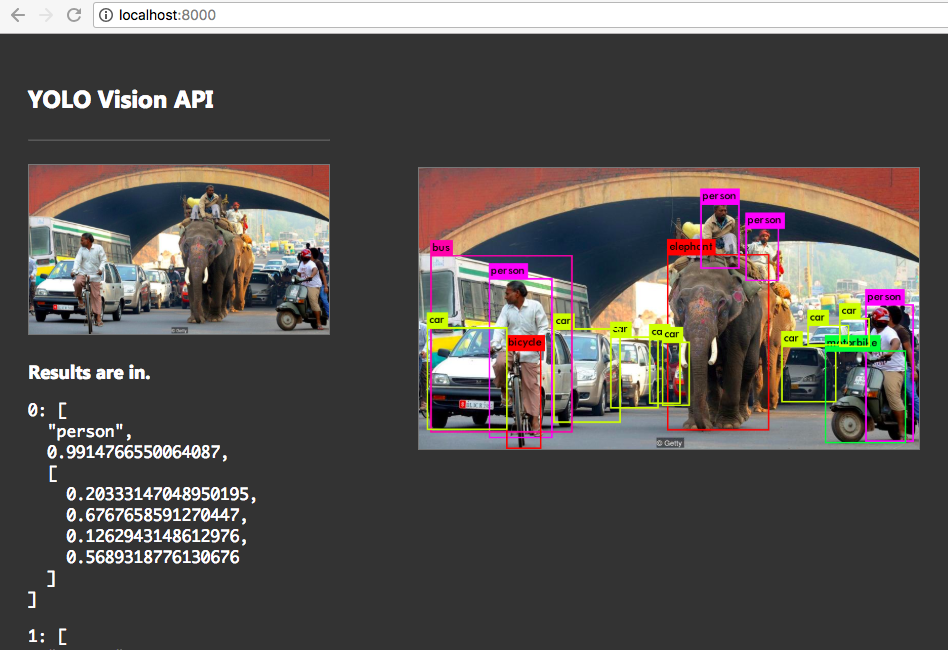

# Yolovision API

* Frontend lovingly stolen from Sarah Drasner (https://codepen.io/sdras/pen/dZOdpv), [object File] bug included.
* Code contributions into frontend by [Radu Matei](https://github.com/radu-matei).

Docker Hub: https://hub.docker.com/r/adcaline/yolovision/

To call the API directly look at the `PUT /images` request in Chrome Dev Tools under Network.

This builds without GPU support but with OpenMP (which brings nothing but false hopes and promises).
For GPU support, install CUDA drivers and toolkit and amend the top of the Makefile.

It's now up to Andrey Vykhodtsev to operationalize this to full potential. No pressure.
